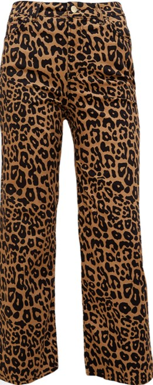
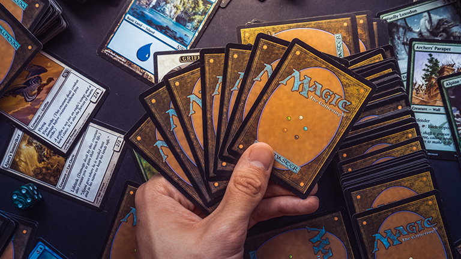

## Prerequisiti {transition="fade-in slide-out"}

- Tutti i riferimenti NON sono puramente casuali. 
- Non mi prendo responsabilità in caso qualcuno si offendesse.
- Non offendetevi vi prego viva l’ironia e l’autoironia.


# Analisi della personalità {transition="zoom" style="text-align: center; color:#5e6472;" background-image="Immagine slide copertina.jpg"}


## Protagonisti: {.unlisted background-gradient="radial-gradient(#000000, #b0b0b0)"}

[Lello]{.underline}

- il pz riporta alta soglia di stress ma altrettanta pazienza sul lavoro e nella vita di coppia
- memoria selettiva si ricorda la provenienza, il lotto e il nome del salmone ma non di pagarmi Netflix

## {transition=“fade” background-gradient="radial-gradient(#000000, #b0b0b0)"}

[Aurora]{.underline}

- tratti da mantenuta
- regina di tiktok 
- dammi un grrr ^[ama molto l'animalier] {.absolute bottom=70 right=50 width="200" height="400"}


##

[Coone]{.underline}

- il pz riporta alti tratti da nerd
- plusdotato in tutti i sensi
- da giocare a Magic a Magic Mike è un attimo {.absolute bottom=100 right=50 width="400" height="200"}

##

[Jack]{.underline}

- detto lo squartatore 
- profilo da serial killer
- gli piace essere sodomizzato dai critici d’arte

##

[Megghi]{.underline} 

- abuso di droghe pesanti, specialmente quelle africane
- vive nel suo mondo hyppie 
- deliri e allucinazioni che terminano solo quando qualcuno le bussa alla porta di casa per svegliarla dal trip
- consiglio per i caregiver: Se la chiami e non ti risponde sai cosa fare

##

[Antonio]{.underline}

- Sindrome di Benjamin Button
- Disturbo del linguaggio 2x
- No mutismo selettivo 


## Ruoli {transition="concave"}
La bionda svampita

e perche proprio...


```{r} 
#| output-location: fragment
ruoli = c("Lello", "Aurora", "Coone", "Jck", "Megghi", "Antonio")
ruoli[2]
```

##

Chi decide di entrare nella casa abbandonata

e perchè proprio...
```{r}
#| output-location: fragment
ruoli[5]
```
## 

La coppietta in camporella
```{r}
#| output-location: fragment
ruoli[1:2]
```

